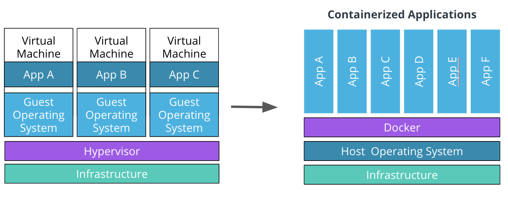

# About
- Cloud Native refers to set of practices that empowers an organization to build applications at scale
- Monolithic scales all components(if memory required more it scales cpu etc ) unlike microservices which provies cost effective scalability,observalibity, better compatibility,functionalities (if used different programmming languages)
- Docker easy manage,deploy,recover and provides same environment to users irrespective of platforms,dependencies etc
- Kubernetes is a container orchestrator framework is capable to create, manage, configure thousands of containers on a set of distributed servers while preserving the connectivity and reachability of these containers. Deployment
- Fluentd or Splunk for logging outputs in cmd shell by std out,error
- Python loggger module  app.logger.info('Main request successfull') and logging.basicConfig(filename='app.log',level=logging.DEBUG) logs all endpoints which has app.logger.info and monitors non urls but if an endpoint doesnt have app.logger.info the endpoint will not be monitored
- Some maintenance operations are split,merge,replace,stale (remove if no longer has business value) increases longviety of project

# Docker
- Hypervisor manages VM by providing virtualization on physical servers. VM replicating consumes lots of resources than required for an app .
- Containers has bare minimum to run application unlike Virtual machines (storage other os functionalities). 
- Multiple VMs on a hypervisor are replaced by multiple containers running on a single host operating system. 
<br>

- Docker file contains instructions to package application such as installing dependencies, compile code or impersonate specific user

```
# set the base image(this is another docker image template which we are using). Since we're running 
# a Python application a Python base image is    used FROM python:3.8
# set a key-value label for the Docker image
LABEL maintainer="Katie Gamanji"
# copy files from the host to the container filesystem. 
# For example, all the files in the current directory (where docker file is present)
# to the  `/app` directory in the container
COPY . /app
# ADD . . add can take url and extract tar,zip etc as source
# defines the working directory within the container
WORKDIR /app
# WORKDIR /app then ADD . . will autmatically copy it to /app since working directory is set
# run commands within the container. 
# For example, invoke a pip command 
# to install dependencies defined in the requirements.txt file. 
RUN pip install -r requirements.txt
# provide a command to run on container start. 
# For example, start the `app.py` application.
CMD [ "python", "app.py" ]
#EXPOSE port
```
```
# build an image using the Dockerfile from the current directory
docker build -t python-helloworld .

# build an image using the Dockerfile from the `lesson1/python-app` directory
docker build -t python-helloworld lesson1/python-app
- if need to specify file name from multiple docker files. example below (default Dockerfile takes in above command)
docker build -f Dockerfile.staging app/backend
```
- 5111 is the host port that we use to access the application e.g. http://127.0.0.1:5111/. The 5000 is the container port that the application is listening to for incoming requests.

```
docker run -d -p 5111:5000 python-helloworld(or image id instead of tag name)
docker run -it busybox-container
# Where OPTIONS can be:
-d, --detach - run in the background 
-p, --publish - expose container port to host
-it - start an interactive shell
docker logs {{ CONTAINER_ID }}
```
- Dockerhub, Harbor, Google Container Registery etc are some of public Docker  Image Registry
- if a tag is not provided (via the -t or --tag flag), then the image would be allocated an ID, which does not have a human-readable format (e.g. 0e5574283393)
- a tag provides version control over application releases, as a new tag would indicate a new release.
```
# tag the `python-helloworld` image, to be pushed 
# in the `iamshirdi` repository, with the `python-helloworld` image name
# and version `v1.0.0`
docker tag python-helloworld(can also use image-id) iamshirdi/hello:v1.0.0


# push the `python-helloworld` application in version v1.0.0 
# to the `iamshirdi` repository in DockerHub
docker push iamshirdi/hello:v1.0.0

docker login
docker images
docker ps
docker pull <remote repository>
docker stop <container id unique short>
```
- To remove all stopped containers, invoke the "docker container prune" command
- By default, Docker will create OCI (Open Container Initiative) compliant images for standardization and OCI complaint runtimes

# Kubernetes
- A container orchestrator framework is capable to create, manage, configure thousands of containers on a set of distributed servers while preserving the connectivity and reachability of these containers. Deployment
- Kubernetes solutionizes portability, scalability, resilience, service discovery, extensibility, and operational cost of containers. Useful for distributed systems
- A Kubernetes cluster is composed of a collection of distributed physical or virtual servers. These are called nodes
- Kubernetes uses functionalities like ReplicaSet, readiness, and liveness probes to handle most of the container failures, which enables powerful self-healing capability.
- Kubernetes has a powerful scheduling mechanism that places an application on the node with sufficient resources to ensure the successful execution of the service
- cluster-autoscaler, which guarantees that the cluster size is directly proportional to the traffic that it needs to handle.
- The suite of master nodes, represents the control plane, while the collection of worker nodes constructs the data plane.
- CRD - Custom Resource Definition provides the ability to extend Kubernetes API and create new resources
#### Control and Data Plane nodes
- kube-apiserver - the nucleus of the cluster that exposes the Kubernetes API, and handles and triggers any operations within the cluster
- kube-scheduler - the mechanism that places the new workloads on a node with sufficient satisfactory resource requirements
- kube-controller-manager - the component that handles controller processes. It ensures that the desired configuration is propagated to resources
- etcd - the key-value store, used for backs-up and keeping manifests for the entire cluster
-  kubelet and k-proxy. These two are special and important as they are installed on all node(dataplane and control plane too).
- kubelet - the agent that runs on every node and notifies the kube- apiserver that this node is part of the cluster
- kube-proxy - a network proxy that ensures the reachability and accessibility of workloads places on this specific node
#### Bootstraping
- Provisioning a Kubernetes cluster is known as the bootstrapping process
- Installing each componenent on node. This implied the distribution and execution of each component independently (e.g. kube-apiserver, kube-scheduler, kubelet, etc.)
- Production-grade cluster
  -kubeadm
  -kubespray
  -kops
  -k3s
- Development
  -kind
  -minikube
  -k3d
#### Vagrant
- Vagrant lets you define virtual machines in a declarative way. instead of spinning vm manually.Vagrant acts as a wrapper around your hypervisor.
- It gives you a way to keep the configuration of your VM, including memory, disk and CPU needs, as well as any possible post install provisioning and configuration steps in a file so that it is easily reproducible
- Run `vagrant init` in an empty directory. There's always one Vagrant box per directory.
- Base Image declaration, Network config, shared folders-default /vagrant for configuration etc where vagrant file is located, provider config:hypervisor settings like memory etc,provisioning post install
```
vagrant init
# Inspect available vagrant boxes 
vagrant status 

# create a vagrant(vm provisining) box using the Vagrantfile in the current directory
vagrant up

# SSH into the vagrant box
# Note: this command uses the .vagrant folder to identify the details of the vagrant box (ssh command run where vargrant folder and file present)

vagrant ssh and (install k3s) and Ctrl + D or C to exit ssh
default password is vagrant 
valgrant suspend,halt or destroy(to remove traces)
```
#### K3s
- curl -sfL https://get.k3s.io | sh 
- sudo su to execute commands as super user
- kubectl get no (notes) to access config file which require elevated privilages
- Usually, the kubeconfig file is stored locally under the ~/.kube/config file. However, k3s places the kubeconfig file within /etc/rancher/k3s/k3s.yaml path
- kubeconfig file can be set through the --kubeconfig kubectl flag or via the KUBECONFIG environmental variable.
  - Cluster - encapsulates the metadata for a cluster, such as the name of the cluster, API server endpoint, and certificate authority used to check the identity of the user.
  - User - contains the user details that want access to the cluster, including the user name, and any authentication metadata, such as username, password, token or client, and key certificates
  - Context - links a user to a cluster. If the user credentials are valid and the cluster is up, access to resources is granted. Also, a current-context can be specified, which instructs which context (cluster and user) should be used to query the cluster.

  ```
  apiVersion: v1
  # define the cluster metadata 
  clusters:
  - cluster:
      certificate-authority-data: {{ CA }}
      server: https://127.0.0.1:63668
    name: udacity-cluster
  # define the user details 
  users:
  # `udacity-user` user authenticates using client and key certificates 
  - name: udacity-user
    user:
      client-certificate-data: {{ CERT }}
      client-key-data: {{ KEY }}
  # `green-user` user authenticates using a token
  - name: green-user
    user:
      token: {{ TOKEN }}
  # define the contexts 
  contexts:
  - context:
      cluster: udacity-cluster
      user: udacity-user
    name: udacity-context
  # set the current context
  current-context: udacity-context
  ```
#### Kind
- kind lets you run Kubernetes on your local computer. This tool requires that you have Docker installed and configured.
- kind create cluster --name demo (requires docker,kubectl for managing)
-  kubectl, allows you to run commands against Kubernetes clusters. You can use kubectl to deploy applications, inspect and manage cluster resources, and view logs
  ```
# Inspect  the endpoints for the cluster and installed add-ons 
kubectl cluster-info

# List all the nodes in the cluster. 
# To get a more detailed view of the nodes, the `-o wide` flag can be passed
kubectl get nodes [-o wide] 

# Describe a cluster node.
# Typical configuration: node IP, capacity (CPU and memory), a list of running pods on the node, podCIDR, etc.
kubectl describe node {{ NODE NAME }}
  ```
#### Deployment
- A node can host multiple pods
- Pods(1:1 container better) - the atomic element within a cluster to manage an application
- Deployments & ReplicaSets - oversees a set of pods for the same application
- Services & Ingress - ensures connectivity and reachability to pods
- Configmaps & Secrets - pass configuration to pods
- Namespaces - provides a logical separation between multiple applications and their resources
- Custom Resource Definition (CRD) - extends Kubernetes API to support custom resources
- A Service resource provides an abstraction layer over a collection of pods running an application. A Service is allocated a cluster IP, that can be used to transfer the traffic to any available pods for an application.
- ClusterIP - exposes the service using an internal cluster IP. If no service type is specified, a ClusterIP service is created by default.
- NodePort - expose the service using a port exposed on all nodes in the cluster.
- LoadBalancer - exposes the service through a load balancer from a public cloud provider such as AWS, Azure, or GCP. This will allow the external traffic to reach the services within the cluster securely.
- To enable the <i>external user</i> to access services within the cluster an Ingress resource is necessary. An Ingress exposes HTTP and HTTPS routes to services within the cluster, using a load balancer provisioned by a cloud provider. Additionally, an Ingress resource has a set of rules that are used to map HTTP(S) endpoints to services running in the cluster. To keep the Ingress rules and load balancer up-to-date an Ingress Controller is introduced.

- ConfigMaps are objects that store non-confidential data in key-value pairs. A Configmap can be consumed by a pod as an environmental variable
Application Deployment and secrets for confidential data:  Environment Variables
-  A Namespace provides a logical separation between multiple applications and associated resources such as memory,cpu etc. Easy team managment and seperation
- Create,Edit,Get,Describe, Delete, label, port-forward,logs are some of common operations on resource

```
# create a Deployment resource
# NAME - required; set the name of the deployment
# IMAGE - required;  specify the Docker image to be executed
# FLAGS - optional; provide extra configuration parameters for the resource
# COMMAND and args - optional; instruct the container to run specific commands when it starts 
kubectl create deploy NAME --image=image [FLAGS] -- [COMMAND] [args]

# Some of the widely used FLAGS are:
-r, --replicas - set the number of replicas
-n, --namespace - set the namespace to run
--port - expose the container port

# create a go-helloworld Deployment in namespace `test` image can be get from online
kubectl create deploy go-helloworld --image=iamshirdi/go-hello-world:v1.0.0 -n test

#Headless pods for devleopment best
kubectl run NAME --image=image [FLAGS] -- [COMMAND] [args...]

# Some of the widely used FLAGS are:
--restart - set the restart policy. Options [Always, OnFailure, Never]
--dry-run - dry run the command. Options [none, client, server]
-it - open an interactive shell to the container

# example: create a busybox pod, with an interactive shell and a restart policy set to Never 
kubectl run -it busybox-test --image=busybox --restart=Never

kubectl get deploy
kubectl get rs (replica set)
kubectl get po
kubectl port-forward po/go-helloworld-fcde-eee 6111:6112(which we want to access localhost)
kubectl edit deploy go-helloworld -o yaml  

# using cluster ip, load balancer etc better than individual pods in case of failure 
# expose the `go-helloworld` deployment on port 8111
# note: the application is serving requests on port 6112
kubectl expose deploy go-helloworld --port=8111 --target-port=6112
kubectl get svc

# create a Configmap
# NAME - required; set the name of the configmap resource
# FLAGS - optional; define  extra configuration parameters for the configmap
kubectl create configmap NAME [FLAGS]

# Some of the widely used FLAGS are:
--from-file - set path to file with key-value pairs 
--from-literal - set key-value pair from command-line

kubectl create secret generic test-secret --from-literal=color=blue
# for config and secret maps checking
kubectl describe cm test-cm
kubectl get secrets
kubectl get secrets test-sec -o yaml (for displaying hash)


# create a Namespace
# NAME - required; set the name of the Namespace
kubectl create ns test-udacity
# to check namespace
kubectl get test-udacity 

# get all the pods in the `test-udacity` Namespace
kubectl get po -n test-udacity
```

#### Declarative Approach- Manifests
- apiversion - API version used to create a Kubernetes object
- kind - object type to be created or configured
- metadata - stores data that makes the object identifiable, such as its name, namespace, and labels
- spec - defines the desired configuration state of the resource

```
# create a resource defined in the YAML manifests with the name manifest.yaml
kubectl apply -f manifest.yaml

# get the base YAML templated for a demo Deployment running a nxing application.> pipe comand to .yam for save and edit etc
 kubectl create deploy demo --image=nginx --dry-run=client -o yaml
```
#### Automatic Failover Best Approaches
- ReplicaSets - to ensure that the desired amount of replicas is up and running at all times
- Liveness probes - to check if the pod is running, and restart it if it is in an errored state
- Readiness probes - ensure that traffic is routed to that pods that are ready to handle requests
- Services - to provide one entry point to all the available pods of an application

#### Paas and Faas
- Cloud foundry open source PAAS(code+manifeits,configuration etc) and can run on any cloud, on premise etc unlike heroku,google app engine
- Function as a service is event driven so cost effective and useful for short time periods unlike PAAS which runs 24x7.Aws lambda,azure,cloud functions
- Newspaper content delivery paas, account creatinon,publishing articles etc Faas less usage

#### CI/CD
- A delivery pipeline includes stages that can test, validate, package, and push new features to a production environment
-The process of propagating an application through multiple environments, until it reached the end-users, is known as the Continuous Delivery (or CD) stage.
- Package - create an executable that contains the latest code and its dependencies. This is a runnable instance of the application that can be deployed to end-users.
- Staging - an environment identical to production, and where a release can be simulated without affecting the end-user experience.
- Continuous Deployment - a procedure that contains the Continuous Integration and Continuous Delivery of a product.
- Package usually refers to executable file or oci complaint image etc  which contains latest features and dependencies (docker build and push)
- The build stage compiles the application source code and associated dependencies( python install -requirments and python app.py etc)
- Jenkins,Circle ci, github actions(event driven:commmit,schedule,external event) etc are some of CI tools
- Github actions usually stored in .github/workflow/python-version.yml
-https://github.com/marketplace/actions/build-and-push-docker-images
- secrets(environment variables) like docker hub username and password can be set in settings :secrets of repository
- Jenkins, CircleCi, ArgoCd some of CD tools which can deploy like kubectl apply -f deployment.yaml
- ArgoCD uses gitops as truth for deploying multiple kubernetes cluster, environments using manifets,config
<br>

```
##  Named of the workflow.
name: Pytest

## Set the trigger policy.
## In this case, the workflow is execute on a `push` event,
## or when a new commit is pushed to the repository
on: [push]

## List the steps to be executed by the workflow
jobs:
  ## Set the name of the job
  build:
    ## Configure the operating system the workflow should run on.
    ## In this case, the job on Ubuntu. Additionally, set a the job
    ## to execute on different Python versions 
    runs-on: ubuntu-latest
    strategy:
      matrix:
        python-version: [2.7, 3.5, 3.6, 3.7, 3.8]
    ## Define a sequence of steps to be executed
    steps:
      ## Use the public `checkout` action  in version v2  
      ## to checkout the existing code in the repository
    - uses: actions/checkout@v2
      ## Use the public `setup-python` actoin  in version v2  
      ## to install python on the Ubuntu based environment.
      ## Additionally, it ensures to loop through all 
      ## the defined Python versions.
    - name: Set up Python ${{ matrix.python-version }}
      uses: actions/setup-python@v2
      with:
        python-version: ${{ matrix.python-version }}
    ## Install all necessary dependecies .
    ## For example, pytest and any defined packages within the requirements.txt file.
    - name: Install dependencies
      run: |
        python -m pip install --upgrade pip
        pip install  pytest 
        if [ -f requirements.txt ]; then pip install -r requirements.txt; fi
    ## Run all pytests by inovking the `pytest command`
    - name: Test with pytest
      run: |
        pytest
```
- Argo Cd Provides Custom resource definitions to configure and manage the application resource
- ArgoCD provides an “app-of-apps” technique that enables a group of applications to be deployed and configured together(microservice)
- helm as template manager for multiple cluster templates
- Helm - package manager that templates exiting manifests, and uses input files to tailor configuration for each environment.(charts-yaml templates describe state)
- Kustomize - a template-free mechanism that uses a base and multiple overlays, to manage the configuration for each environment
- Jsonnet - a programming language, that enables the templating of manifests as JSON files, that can be easily consumed by Kubernetes
```
## Argo cd server node port for local access computer through ports static vm access
apiVersion: v1
kind: Service
metadata:
  annotations:
  labels:
    app.kubernetes.io/component: server
    app.kubernetes.io/name: argocd-server
    app.kubernetes.io/part-of: argocd
  name: argocd-server-nodeport
  namespace: argocd
spec:
  ports:
  - name: http
    port: 80
    protocol: TCP
    targetPort: 8080
    nodePort: 30007
  - name: https
    port: 443
    protocol: TCP
    targetPort: 8080
    nodePort: 30008
  selector:
    app.kubernetes.io/name: argocd-server
  sessionAffinity: None
  type: NodePort
```

#### Helm
- Chart.yaml - expose chart details, such as description, version, and dependencies
- templates/ folder - contains templates YAML manifests for Kubernetes resources
- values.yaml - default input configuration file for the chart. If no override input file is provided, the Helm chart will fallback to using the default values.yaml file (included with the chart).
- Argo CD supports config toools helm

```
apiVersion: v1
kind: Namespace
metadata:
# if no value provided it takes from default values.yaml
  name: {{ .Values.namespace.name }} 

#values.yaml
# provide the name of the namespace
namespace:
  name: test (test-prod.yaml)
## Argo CD
  [...]
  source:
    ## change the source of manifests to a Helm chart
    helm:
      ## define the input values file
      valueFiles:
      - values.yaml (values-prod.yaml)
    ## set the path to the folder where the Helm chart is stored
    path: solutions/helm/python-helloworld
    ## set the base repository that contains the Helm chart
    repoURL: https://github.com/udacity/nd064_course_1 
    targetRevision: HEAD
```
#### Push and pull model
- Push based higher risk for multiple commits at once(no active propogation)
- Jenkins, CircleCI
- Pull based identifies new changes and applies them to a Kubernetes cluster as soon as available
- Argo Cd,Flux
- pull pipeline, a Kubernetes Operator deploys new images from inside of the cluster unlike push which exposes credentials