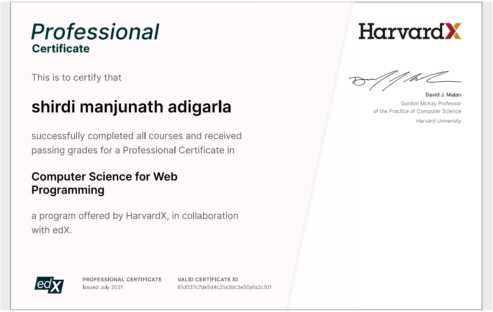

# Computer Science for Web Programming 

- A broad and robust understanding of computer science and programming
- How to scale your web applications
- How to keep track of changes made to code, synchronize code between different people, and test changes to code
- The various ways an API can be used
- How to design and implement web pages and web apps
- Familiarity in a number of languages, including C, Python, SQL, and JavaScript plus CSS and HTML

 

# Projects
- <a href= https://github.com/iamshirdi/Web-Programming/tree/master/http_server>Http.Server Minigame Backend Python Server</a>
- <a href= https://youtu.be/bvaaDaLQaok>Social Network App to create edit follow and like posts using Django and Javascript</a>
- <a href= https://youtu.be/BzhRPmVW7qw>Auction Implementation using django</a>
- <a href= https://youtu.be/USCg6FCGSeI>Mail App using Pure Js and django as backend database</a>
- <a href= https://github.com/iamshirdi/Web-Programming/tree/master/node.js> Node.js API create using twitch,youtube API </a>
- <a href= https://youtu.be/vJRpiMn5jdgs> Wiki Implementation using django </a>
- <a href= https://youtu.be/hpy22xtigZs>Google Search Engine  Pure HTML </a>
- Django Gravitar API 

