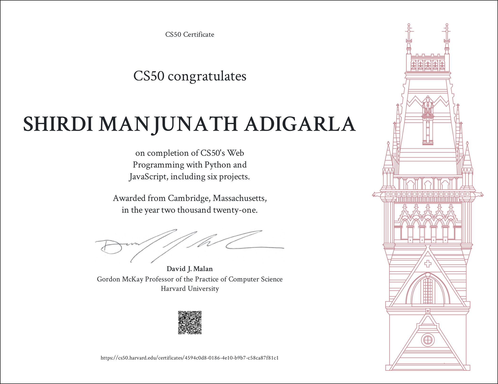

### Projects
- <a href= https://youtu.be/bvaaDaLQaok>Social Network App to create edit follow and like posts using Django and Javascript</a>
- <a href= https://youtu.be/BzhRPmVW7qw>Auction Implementation using django</a>
- <a href= https://youtu.be/USCg6FCGSeI>Mail App using Pure Js and django as backend database</a>
- <a href= https://youtu.be/vJRpiMn5jdgs> Wiki Implementation using django </a>
- <a href= https://youtu.be/hpy22xtigZs>Google Search Engine  Pure HTML </a>

